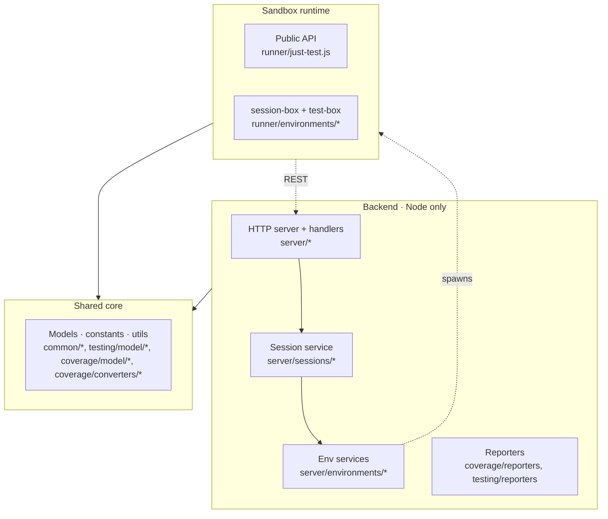
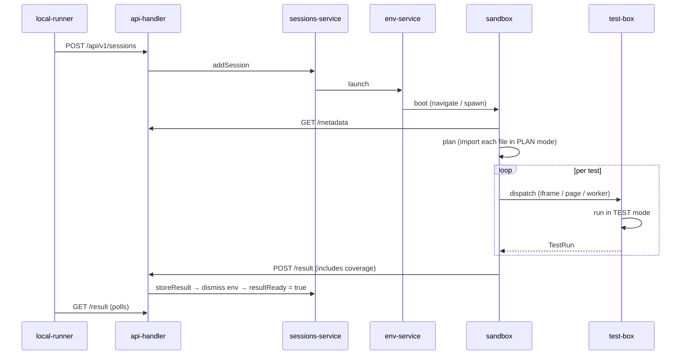

# Architecture

`just-test` is a **backend + sandbox** test harness. A Node backend orchestrates sessions and serves assets; tests execute inside sandboxes (Node worker threads, browser pages/iframes/workers, or an interactive browser tab) and report back through one REST contract. Result and coverage shapes are identical regardless of where the test ran.

---

## 1. Layers



- **Shared core** runs identically on backend and in every sandbox. This is the foundation of the uniform-report-shape invariant.
- **Backend** orchestrates, owns HTTP, synthesizes final reports.
- **Env services** bridge backend to sandbox: Playwright for browsers, `worker_thread` for Node, URL-only for interactive.
- **Sandbox runtime** (`src/runner`) runs inside whichever executor was spawned. `runner/just-test.js` is the public `test()` API.
- **UI** (`src/ui`) is interactive-only and plays no role in automated runs.

## 2. Entry points

| Entry | Purpose |
|---|---|
| `local-runner.ts` | CLI: starts server in-process, posts config, polls `/result`, writes `reports/results-<env>.xml` + `reports/coverage-<env>.lcov` (suffix derived from the environment — e.g. `nodejs`, `chromium-iframe`), exits. |
| `server/cli.ts` | Starts the server only. Interactive: a human opens the logged session URL. |

Both accept `key=value` CLI arguments merged over the loaded config. `src/configurer.js` is dead code — delete pending.

---

## 3. Session lifecycle



Per-test coverage rides **inside** `envResult` — no side-channel artifact merge. The `/result` endpoint returns 204 until `resultReady` flips.

Multi-env session finalization is not merged: today the last-reporting env overwrites `session.result` (`sessions-service.js:finalizeSession` TODO). Out of scope for 5.0.0.

---

## 4. Coverage

One code path in the test-box, regardless of mode:

```js
await globalThis.__jtStartCoverage();
// run test
const coverage = await globalThis.__jtStopCoverage();
// attach to TestRun.coverage, post result
```

Backend exposes `__jtStartCoverage` / `__jtStopCoverage` as Playwright `context.exposeBinding`s. The binding uses `source.page` and ref-counts overlapping starts, so parallel tests on a shared page don't double-arm V8.

| Mode | Where the binding fires | Attribution |
|---|---|---|
| **Node (worker_thread)** | `nodejs-test-box.ts` uses Inspector `Profiler.startPreciseCoverage` directly — no binding, same shape | Per-test |
| **Browser `page`** | Binding → each test's own child page | **Per-test** |
| **Browser `iframe`** (default) | Binding → main page (iframes share V8). Session-box collapses per-test coverage into `session.coverage` after `runSession`; `local-runner` emits `TN:__session__` | Session-global |
| **Browser `worker`** | Worker has no `window` and no binding reaches it; test-box installs no-op shims | None (page.coverage doesn't cover workers) |
| **Interactive** | Binding is wired but there's no automated coverage report | Session-global by nature |

URL normalization is centralized in `coverage/model/url-utils.ts` (`normalizeCoverageUrl`) and applied at every matcher boundary.

Only `page` mode gives true per-test browser coverage. `iframe` is the default (cheaper, fewer pages) and produces honest session-global coverage. Choose per config; policy is explicit in `docs/coverage.md`.

---

## 5. Public API

`runner/just-test.js` exports:

```js
export { test, TestDto };
```

- `test(name, code, opts)` — declare a test. Mode-dependent via execution context (`PLAN` registers, `TEST` runs, `PLAIN_RUN` runs immediately for library use). Per-test timeout enforced by `Promise.race` (default 3000 ms).
- `TestDto` — payload passed to `opts`.

Assertions live in `common/assert-utils.js` (consumed, not advertised).

**Removed in 5.0.0:** `suite()`.

---

## 6. Dogfooding

`tests/` uses just-test on itself; per-env configs under `tests/_configs/`:

- `tests-config-ci-chromium.ts` — default iframe executor
- `tests-config-ci-chromium-page.ts` — page-per-test (real per-test coverage)
- `tests-config-ci-chromium-worker.ts` — worker-per-test (no coverage, exercises the no-op path)
- `tests-config-ci-firefox.ts`, `-webkit.ts` — cross-browser
- `tests-config-ci-nodejs.ts` — node worker threads

Covered: models, coverage utilities, server utilities. Not covered: session orchestration, env launch, interactive UI.

### 6.1 Test harness imports

Tests import the harness (`@gullerya/just-test`, `@gullerya/just-test/assert`) and any third-party library in one of two forms, depending on the sandbox they run in:

**Default — bare imports.** Every test in this repo outside `tests/_worker/` uses bare specifiers:

```ts
import { test } from '@gullerya/just-test';
import { assert } from '@gullerya/just-test/assert';
```

Node resolves them via `node_modules`. Browsers resolve them through an importmap that the static handler injects into `browser-session-box.html` / `browser-test-box.html` (see `DEFAULT_BROWSER_IMPORTS` in `server/environments/environments-configurer.ts`). This covers the Node, iframe, and page executors.

**Worker-mode exception — relative path through `node_modules/`.** Web Workers (`new Worker(url, { type: 'module' })`) do not inherit the host document's importmap in any browser today, so bare specifiers fail to resolve inside the worker test-box. Tests that must run under the `worker` executor live under `tests/_worker/` and use a relative path instead:

```ts
import { test } from '../../node_modules/@gullerya/just-test/bin/runner/just-test.js';
import { assert } from '../../node_modules/@gullerya/just-test/bin/common/assert-utils.js';
```

Node resolves this as a file path; the `/static/` handler (which serves from cwd) serves the same path to browsers — so the exact same string works in every environment.

**Rule of thumb.** Prefer bare imports for maintainability. Put a test under `tests/_worker/` (and use the relative-path form) only if you specifically need worker-mode coverage for that behavior. The worker-mode config (`tests-config-ci-chromium-worker.ts`) is scoped to `tests/_worker/**` and the non-worker configs exclude it, so the matrix exercises both import styles without overlap.

---

## 7. Open gaps

| # | Tier | What |
|---|---|---|
| 1 | 2 | Test discovery duplicated between `browser-session-box.js` and `nodejs-session-box.ts` — extract a shared `planSession`. |
| 2 | 2 | `src/configurer.js` is dead — delete. |
| 3 | 3 | Multi-env session finalization: last env wins; `sessions-service.js:finalizeSession` is still a TODO. |
| 4 | 3 | Resource pooling of iframes/pages/workers (three TODOs in `browser-session-box.js`). |
| 5 | 3 | `functions` coverage in `v8-coverage-converter.js` — not emitted to lcov; line-level is sufficient for now. |
