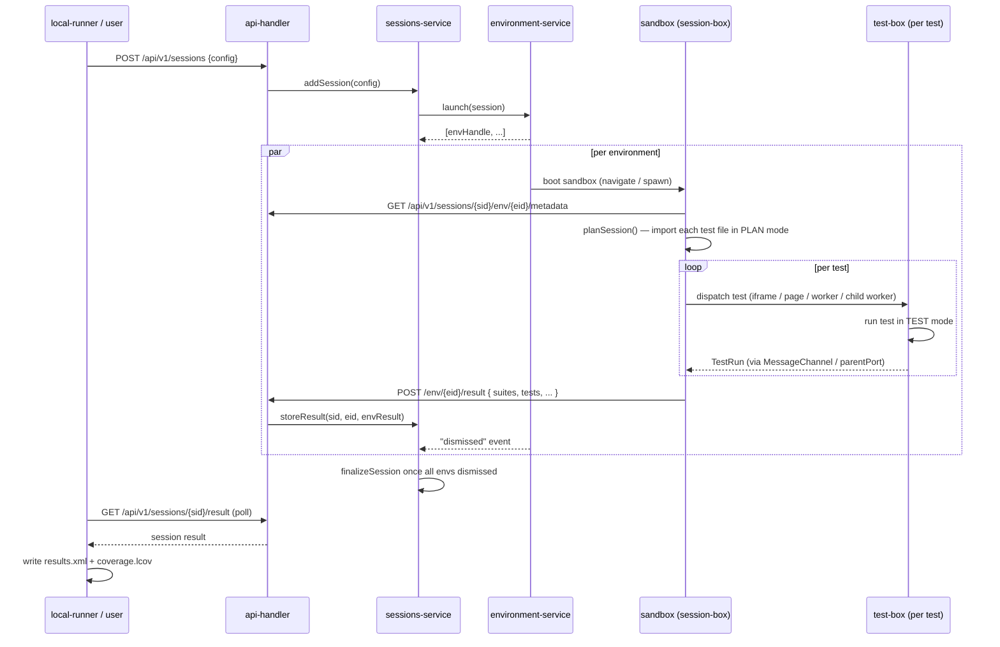
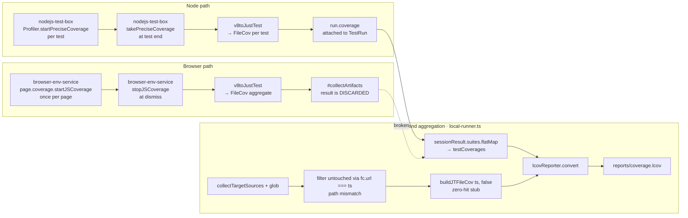

# Architecture

`just-test` is a test harness with a **server/sandbox** split. A Node.js **backend** orchestrates sessions and serves assets; tests execute inside **sandboxes** (Node worker threads, browser pages/iframes/workers, or an interactive browser tab); every sandbox reports back through the same REST contract so the backend can produce unified results and coverage regardless of where tests ran.

This document describes the current code. Gaps between "current" and "target" are called out explicitly in [§8 Known gaps](#8-known-gaps).

---

## 1. Layers and subsystems

The code organizes into seven layers. Each file belongs to exactly one.

```mermaid
graph TB
	subgraph Entry[Entry points]
		CLI[local-runner.ts<br/>automated CLI]
		SRV[server/cli.ts<br/>standalone server]
	end
	subgraph Backend[Backend · Node only]
		HTTP[HTTP server<br/>server/server-service.ts]
		HDL[Request handlers<br/>server/handlers/*]
		SES[Session service<br/>server/sessions/*]
		ENV[Environment services<br/>server/environments/*]
		COV[Coverage aggregation<br/>coverage/coverage-service.js<br/>coverage/reporters/lcov-reporter.js]
		XUN[xUnit reporter<br/>testing/reporters/xunit-reporter.js]
	end
	subgraph AGlue[Automation glue]
		PWR[Playwright driver<br/>server/environments/browser/browser-env-service.js]
		WT[worker_thread spawner<br/>server/environments/nodejs/nodejs-env-service.js]
	end
	subgraph IGlue[Interactive glue]
		IES[interactive-env-service.js<br/>logs URL, no launch]
	end
	subgraph Sandbox[Sandbox runtime · runs inside executor]
		JST[test API<br/>runner/just-test.js]
		SSS[session box<br/>runner/environments/&#123;nodejs,browser&#125;/*-session-box]
		TSS[test box<br/>runner/environments/&#123;nodejs,browser&#125;/*-test-box]
		STS[state service<br/>runner/simple-state-service.ts]
		SAS[server-api-service.js<br/>REST client]
	end
	subgraph Core[Shared core · runs everywhere]
		MDL[Test models<br/>testing/model/*]
		CMC[Constants & errors<br/>common/*<br/>testing/model/test-error.ts]
		CVM[Coverage model<br/>coverage/model/*<br/>coverage/converters/v8-coverage-converter.js]
	end
	subgraph UI[UI · interactive only]
		UIC[ui/components/*]
	end

	CLI --> HTTP
	SRV --> HTTP
	HTTP --> HDL
	HDL --> SES
	SES --> ENV
	ENV --> PWR
	ENV --> WT
	ENV --> IES
	PWR -. spawns .-> Sandbox
	WT -. spawns .-> Sandbox
	IES -. user opens URL .-> Sandbox
	Sandbox --> SAS
	SAS -. REST .-> HDL
	SES --> COV
	SES --> XUN
	Sandbox --> Core
	Backend --> Core
	UI -. rendered in .-> Sandbox
```



### Shared core (`src/common`, `src/testing/model`, `src/coverage/model`, `src/coverage/converters`)

Runs identically on backend and in every sandbox. This is the foundation of the "uniform report shape" invariant.

| File | Role |
|---|---|
| `common/constants.js` | `EVENT`, `STATUS` enums. |
| `common/random-utils.js`, `time-utils.js`, `assert-utils.js`, `interop-utils.js` | Pure utilities. |
| `common/xml/*` | XML DOM shim for xUnit reporter. |
| `testing/model/session.ts`, `suite.ts`, `test.ts`, `test-run.ts` | DTOs serialized across REST. |
| `testing/model/test-error.ts` | Error serialization (`TestError.fromError`). |
| `coverage/model/file-cov.ts`, `line-cov.ts`, `range-cov.ts`, `model-utils.js`, `range-utils.js` | Coverage data structures and line/range reconciliation. |
| `coverage/converters/v8-coverage-converter.js` | V8 raw format → `FileCov`. Shared by Node and browser paths. |

### Backend (`src/server`, `src/coverage/coverage-service.js`, `src/coverage/reporters`, `src/testing/reporters`)

Node-only. Orchestration, HTTP, final report synthesis.

| File | Role |
|---|---|
| `server/server-service.ts` | HTTP server, handler dispatch. |
| `server/handlers/api-request-handler.ts` | `POST /api/v1/sessions` (create), `POST .../result` (sandbox reports), `GET .../result` (CLI polls). |
| `server/handlers/static-request-handler.ts` | Serves test files from `./tests` under `/static/`. |
| `server/handlers/core-request-handler.ts` | Serves compiled framework modules to sandboxes. |
| `server/sessions/sessions-service.js` | Session lifecycle: create, run, store env results, finalize. |
| `server/sessions/sessions-configurer.js` | Config validation/defaults. |
| `server/environments/environments-service.js` | Launches the right env service per config. |
| `coverage/coverage-service.js` | `collectTargetSources` (glob with include/exclude). |
| `coverage/reporters/lcov-reporter.js` | `TN:` per-test + `SF:` untouched-file records → final lcov. |
| `testing/reporters/xunit-reporter.js` | Session result → JUnit XML. |

### Automation glue (`src/server/environments/browser`, `src/server/environments/nodejs`)

Bridges backend to sandbox for automated runs.

| File | Role |
|---|---|
| `server/environments/browser/browser-env-service.js` | Launches Playwright, creates context, navigates the main page to the session-box URL, hooks `page.coverage`. |
| `server/environments/nodejs/nodejs-env-service.js` | Spawns a `worker_thread`, sets `workerData`, tees stdio to per-env log. |
| `server/environments/environment-base.js` | Common `EventTarget` base (emits `dismissed`, `error`). |

### Interactive glue (`src/server/environments/interactive`)

| File | Role |
|---|---|
| `server/environments/interactive/interactive-env-service.js` | Logs the URL a human should open. Does not launch a browser. |

### Sandbox runtime (`src/runner`)

Runs **inside** the sandbox (worker thread, browser page, iframe, web worker, or interactive tab). The public `test()` function lives here; the session- and test-boxes are the entry modules that a sandbox actually loads.

| File | Role |
|---|---|
| `runner/just-test.js` | Public API: `test()`, `TestDto`. |
| `runner/environment-config.js` | Execution-context registry (`PLAN` / `TEST` / `PLAIN_RUN`) keyed on a global `Symbol.for`. |
| `runner/session-service.ts` | Drives suite/test dispatch inside a session-box given an injected executor. |
| `runner/simple-state-service.ts` | In-sandbox session state; serializes to the REST report shape. |
| `runner/server-api-service.js` | REST client used by sandboxes to fetch metadata and post results. |
| `runner/environments/browser/browser-session-box.js` | Loaded in the main browser page. Plans session, dispatches each test to an iframe/page/worker executor. |
| `runner/environments/browser/browser-test-box.js` | Loaded in the executor (iframe/page/worker). Runs one test, posts result back via `MessageChannel`. |
| `runner/environments/nodejs/nodejs-session-box.ts` | Main worker thread. Plans session, spawns one child worker per test. |
| `runner/environments/nodejs/nodejs-test-box.ts` | Per-test worker. Runs the test; wraps execution with Inspector `Profiler.startPreciseCoverage` / `takePreciseCoverage`. |

### UI (`src/ui`)

`ui/components/jt-*` — web components (header, suite, test, status, duration, details, error) shown in interactive mode. No role in automated runs.

### Entry points (`src/local-runner.ts`, `src/server/cli.ts`)

- `local-runner.ts` — CLI: starts server, `POST`s config, polls `/result`, writes `reports/results.xml` and `reports/coverage.lcov`, exits.
- `server/cli.ts` — starts the server only. Used for interactive. Session is created later (by a human opening the interactive URL, which triggers the same `addSession` path).

**Dead:** `src/configurer.js` is unreferenced; `server/cli.ts` supersedes it.

---

## 2. Invariants: automated vs interactive

| Concern | Automated | Interactive | Status |
|---|---|---|---|
| Test discovery & planning | `planSession()` in session-box | `planSession()` in session-box | **Shared logic** — but currently duplicated across `browser-session-box.js` and `nodejs-session-box.ts`. |
| Test execution (`test()` semantics, lifecycle, error capture) | `runner/just-test.js` | `runner/just-test.js` | **Invariant.** |
| Result shape (`Session → Suite → Test → TestRun`) | `SimpleStateService` | `SimpleStateService` | **Invariant.** |
| Result transport | `POST /api/v1/sessions/{sid}/environments/{eid}/result` | same | **Invariant (REST).** |
| Session creation | `local-runner.ts` POSTs config | User opens URL; backend creates session on first visit | Differs at bootstrap only. |
| Coverage trigger (Node) | Per-test Inspector snapshots | n/a | — |
| Coverage trigger (Browser) | `page.coverage.start/stopJSCoverage`, one span per page lifetime | Same code path would apply if coverage config were present | **Session-global, not per-test** (see §4). |
| Timeout enforcement | Env-level TTL + per-test TTL | Per-test TTL only (interactive has no wall clock) | Differs by design. |
| Dismissal | Playwright closes browser / worker exits | User closes tab | Differs by design. |

**Takeaway:** the split between automated and interactive is a thin shell around a single shared runtime. Once a sandbox has booted, the code path is identical. The only non-trivial divergence is **who closes the session** (Playwright vs. a human).

---

## 3. Session lifecycle



**Note on finalization:** `sessions-service.js:109` has a `TODO: calculate session status/result from the envs`. Currently the last env's `envResult` overwrites `session.result` (line 80). Multi-env sessions are not yet truly merged.

---

## 4. Coverage pipeline

Two paths converge on the same lcov writer. They differ in **where per-test attribution happens** (or fails to).



### Node path (works)

1. `nodejs-env-service.js` spawns the session-box worker with coverage config in `workerData`.
2. For each test, `nodejs-test-box.ts` opens an Inspector `Session`, calls `Profiler.startPreciseCoverage({ callCount: true, detailed: true })` before the test, `takePreciseCoverage` after (`nodejs-test-box.ts:58-66`), filters by cwd prefix + `minimatch` (lines ~84-108), rewrites URLs to `./<relpath>`, converts via `v8toJustTest`, attaches to `run.coverage`.
3. The session-box posts the session result; `run.coverage` rides along and survives into `sessionResult.suites[].tests[].lastRun.coverage` on the backend.
4. `local-runner.ts:96-106` extracts per-test coverage into `testCoverages`.

### Browser path (broken)

1. `browser-env-service.js#initCoverage` (line 133) calls `page.coverage.startJSCoverage()` once per page.
2. The main page loads `browser-session-box.js`, which dispatches tests to iframes (default), pages, or workers. Coverage is **never sliced** at test boundaries.
3. At dismiss, `#collectCoverage` (line 160) calls `stopJSCoverage` on each page (`#coverageData` bucket), filters by URL suffix, rewrites `${origin}/static/` → `./`, feeds `v8toJustTest`, and returns `{ coverage }` from `#collectArtifacts`.
4. **The return value is discarded.** `sessions-service.js:83-97` contains the commented-out block that would attach artifacts to tests; the live `storeResult` signature doesn't even receive artifacts.
5. `local-runner.ts` therefore sees `testCoverages = []` for browser sessions; every target file falls through to the `buildJTFileCov(ts, false)` zero-hit stub (line 116).

### Path-matching seam

`local-runner.ts:114` filters already-covered targets with strict equality:

```ts
targetSources.filter(ts => !testCoverages.flatMap(tc => tc.coverage).some(fc => fc.url === ts))
```

- `collectTargetSources` returns glob output: `dist/data-tier.js` (no prefix).
- The Node path rewrites URLs to `./src/x.js`.
- The browser path rewrites `${origin}/static/` → `./dist/x.js`.

Strict `===` never matches across the `./` prefix. Everything falls through to the zero-hit branch, duplicating every real record.

### Browser executor modes & coverage implications

`runner/environments/browser/browser-session-box.js` defines three modes (lines 91-151):

| Mode | How each test runs | Coverage bucket |
|---|---|---|
| `iframe` (default) | `document.createElement('iframe')` inside the main page | Shares the main page's v8 → one aggregate bucket for the whole session. Per-test attribution impossible. |
| `page` | `globalThis.open(executorUrl)` → Playwright's `context.on('page')` fires → `#setupPage` → `#initCoverage` → **new bucket per page** | Per-page coverage exists. If one page = one test, this is effectively per-test. The code already opens a new page per test; the wiring back to tests is what's missing. |
| `worker` | `new Worker(...)` | `page.coverage` does not cover worker scripts. No coverage possible. |

---

## 5. Public API

`runner/just-test.js` exports:

```js
export { test, TestDto };
```

- `test(name, code, opts)` — the only way to declare a test. Behavior is mode-dependent via the execution context (`PLAN` registers, `TEST` runs, `PLAIN_RUN` runs immediately for library use). Timeout enforced by `Promise.race` against `opts.ttl` (default 3000 ms).
- `TestDto` — the payload shape passed to `opts`.

Assertions are not part of the public API; `common/assert-utils.js` is consumed by tests but not advertised.

**Removed in 5.0.0:** `suite()` (previously exported as a validate-only stub).

---

## 6. CLI / entry points

| Entry | Command | Behavior |
|---|---|---|
| `local-runner.ts` | `node bin/local-runner.js config_file=./config.js` | Starts server (in-process), posts config, polls result, writes reports, exits. |
| `server/cli.ts` | `node bin/server/cli.js config_file=./config.js` | Starts server only. Used for interactive: a human opens the session URL printed in logs. |

Both accept `key=value` CLI arguments merged over the loaded config.

---

## 7. Dogfooding

`tests/` uses just-test itself, with per-environment configs under `tests/configs/` (`tests-config-ci-chromium.ts`, `-firefox.ts`, `-webkit.ts`, `-nodejs.ts`, `-dev.ts`). Covered: models, coverage utilities, server utilities. Not covered: session orchestration, environment launch, per-env integration, interactive UI.

---

## 8. Known gaps

Ordered by severity.

### 8.1 Per-test browser coverage not collected — **Tier 1, fixes in 5.0.0**

**Where:** `server/environments/browser/browser-env-service.js` — `startJSCoverage` at page load, `stopJSCoverage` at dismiss, no test-boundary splits.

**Plan.** In `page` executor mode, each test already runs in its own Playwright Page (`context.on('page')` fires; `#setupPage` initializes a dedicated coverage bucket). Stop aggregating at dismiss; instead, when a test completes and its page is about to close, call `stopJSCoverage` **on that page**, convert, and stash the result keyed by `testId`. Pass the map back through `#collectArtifacts` to the session.

**Policy:** when `coverage` is configured, `page` is the default executor. `iframe` and `worker` remain selectable but produce session-global coverage only (documented, not per-test). Interactive mode is session-global by design.

### 8.2 Browser coverage artifacts are discarded — **Tier 1, fixes in 5.0.0**

**Where:** `server/sessions/sessions-service.js:83-97` (commented out); `storeResult` signature (line 74) has no `artifacts` parameter.

**Plan.** Extend `storeResult(sesId, envId, envResult, artifacts)` to accept artifacts, iterate `artifacts.coverage` by `testId`, and set `test.lastRun.coverage`. Update the REST handler to forward artifacts (or fold them into `envResult` since the sandbox already produces them in the same shape for Node).

### 8.3 URL-normalization mismatch in the matcher — **Tier 1, fixes in 5.0.0**

**Where:** `local-runner.ts:114` strict `fc.url === ts`; `browser-env-service.js:170` `./` rewrite; `nodejs-test-box.ts:84-87` cwd-strip + `./` rewrite; `collectTargetSources` returns bare glob output.

**Plan.** Add a single `coverage/model/url-utils.ts` with `normalize(url)` that strips leading `./` and query/hash. Apply at both ends of the matcher. This removes three ad-hoc rewrites.

### 8.4 Test discovery duplicated across envs — **Tier 2**

**Where:** `runner/environments/browser/browser-session-box.js:66-89` vs `runner/environments/nodejs/nodejs-session-box.ts` planning loop.

**Plan.** Extract `planSession(testsResources, stateService, fetcher)` into `runner/planner.js` (or `.ts`). Inject the fetcher (`/static/` URL vs `pathToFileURL`).

### 8.5 `src/configurer.js` is dead — **Tier 2**

**Plan.** Delete. Confirm no import, then remove.

### 8.6 Multi-env session finalization — **Tier 3**

**Where:** `server/sessions/sessions-service.js:80` overwrites `session.result` on every env report; line 109 is still a `TODO`.

**Plan.** Accumulate `envResult`s in a map keyed by envId; finalize by merging. Out of scope for 5.0.0.

### 8.7 Resource pooling — **Tier 3**

**Where:** three `TODO: this should be resource pooled` comments in `browser-session-box.js` (iframes, pages, workers).

**Plan.** Not for 5.0.0.

### 8.8 `functions` coverage in v8 converter — **Tier 3**

**Where:** `coverage/converters/v8-coverage-converter.js:31` is a `TODO`. lcov reporter doesn't emit `FN`/`FNDA` yet; line-level coverage is sufficient for now.

---

## 9. Target shape after 5.0.0

After Tier 1 lands:

- Browser `page` executor produces per-test coverage identical in shape to Node's.
- `storeResult` accepts artifacts; both envs route per-test coverage the same way.
- `local-runner` matches targets against real coverage URLs after normalization; untouched-file fallback only fires for genuinely untouched files.
- All three outputs (`results.xml`, `coverage.lcov`, and the session result exposed via REST) are uniform across Node, browser, and interactive (the last produces no coverage file by design).

Tier 2/3 items stay on this doc as explicit followups.
